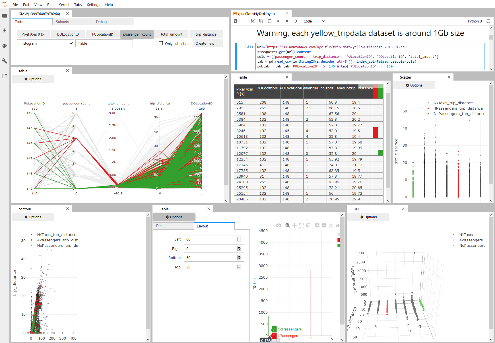

# Floatview Stats

<table>
    <tr>
        <td>Latest Release</td>
        <td>
            <a href="https://pypi.org/project/floatview/"/>
            
        </td>
    </tr>
    <tr>
        <td>PyPI Downloads</td>
        <td>
            <a href="https://pepy.tech/project/floatview"/>
            
        </td>
    </tr>
</table>

# Floatview

A floatview output widget for JupyterLab and a data explorer for glue/iplotly

## Installation

If you use jupyterlab:

```bash
pip install floatview
jupyter labextension install @jupyterlab/plotly-extension@0.18.1
jupyter labextension install plotlywidget@0.6.0
jupyter labextension install @jupyter-widgets/jupyterlab-manager
jupyter labextension install jupyterlab-floatview
```

## Usage

The floatview widget is used as a context manager, just like ipywidgets' output
widget.

```python
from floatview import Floatview
from ipywidgets import IntSlider

sc = Floatview(title='Floatview Output', mode='tab-after')
sl = IntSlider(description='Some slider')
with sc:
    display(sl)
```


When a single output is displayed in a Floatview, it is allowed to occupy all of
the vertical space available. If more content is displayed, the natural height
is used instead.

The gluemanagerwidget is used as a data/visualization manager for a glue dataset.

```python
from floatview import GlueManagerWidget
from pandas import read_csv

data = read_csv('your_data.csv', index_col=False, usecols=cols)
gmw = GlueManagerWidget(subtab, modal=True, label="Data")
```


